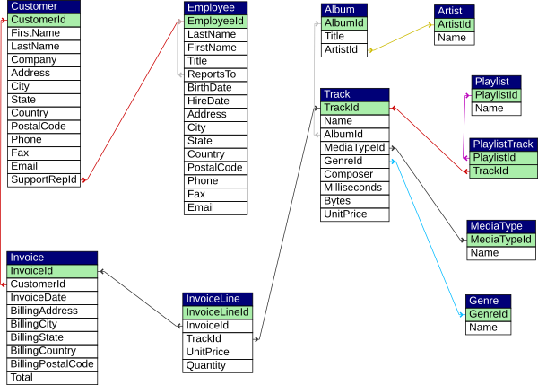

# M151 Chinook J2EE

This is an extensible J2EE-Webproject to demonstrate the cooperation of servlets, JSP and JDBC within an Apache Tomcat and MySQL Application.

The project is based on a web tutorial: [http://o7planning.org/en/10285/create-a-simple-java-web-application-using-servlet-jsp-and-jdbc](http://o7planning.org/en/10285/create-a-simple-java-web-application-using-servlet-jsp-and-jdbc). Instead of the database used in O7Planning tutorial, the Chinook database [https://github.com/lerocha/chinook-database](https://github.com/lerocha/chinook-database) is used.



## Setup DB (Mysql on Debian)

```bash
cd lampstack..
./use_lamstack
mysqld --skip-grant-tables
```
```mysql
//login mysql client without credentials: mysql
FLUSH PRIVILEGES;
SET PASSWORD FOR 'root'@'localhost' = PASSWORD('abc_1234');
FLUSH PRIVILEGES;
exit
```

```bash
ps aux | grep mysql
kill *6600*
```